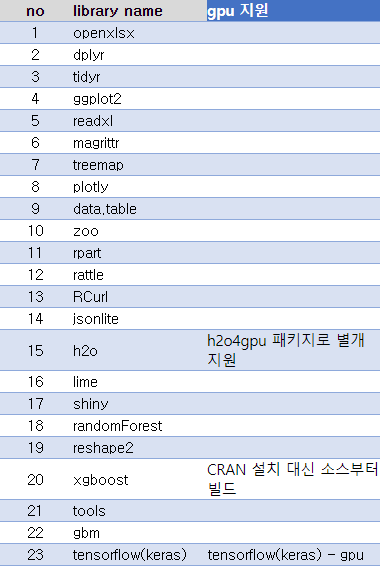

# Rstudio with GPU Docker Container
- R(4.0.3)
- Rstudio(1.4) 
- cuda(11.0)
- ubuntu 18.04

# Rstudio CPU Docker Container
- R(4.0.3)
- Rstudio(1.4)
- ubuntu 18.04

---

## directory 
- dev
  - deprecated files and some memo note
  - it is not need at runtime
- docker-gpu
  - parent docker image Dockerfiles with some binaries
  - [tensorflow (lsw-base:cuda11.0)] > [r-ver (lsw-r-ver:cuda11.0)] > [rstudio (lsw-rstudio:cuda11.0)] > [R packages (rstudiio-test-gpu:cuda11.0)](가장 바깥 Dockerfile) 순으로 빌드
- docker-cpu
  - parent docker image Dockerfiles with some binaries
  - [r-ver (lsw-r-ver:cpu)] > [rstudio (lsw-rstudio:cpu)] > [R packages (rstudiio-test:cpu)](가장 바깥 Dockerfile) 순으로 빌드  
- files
  - binaries for container
    - for repop setting
    - for shell command
    - ...
- hadoop-bin
  - for connection to HDFS Cluster
  - HADOOP Client 3.1.4
  - Spark Client 3.0.1
  - Hive 
- sample-rscript
  - sample script for each packages

## build final container
- change repo to prireg
- install ML packages
- CPU
  - `./build.sh`
- GPU
  - `./build.sh gpu`  

## demo
- user
  - `ecube`: hdfs, spark, rstudio 사용
  - `ruser01,02,03`: rstudio 만 사용, rgroup으로 묶여서 서로 홈디렉토리 읽기 가능
- CPU 버전 컨테이너는 R 3.6버전
  - 4.0.3 공식 버전에 처음 시작 안되는 오류 있음
  - 최적화 안되있어서 사용 비추천
- GPU  
  - CUDA 11.0 버전 사용
  - tensorflow, xgboost, h2o4gpu 패키지는 gpu에서 학습

---
## packages

## dev tip
- files/rstudio-entrypoint.sh, files/Renviron.site, Dockerfile 모두 environment vairable 동기화 필요
- 현재 r-ver 에서 R 설치 후 /usr/local/cuda 내의 일부 파일들이 삭제되는 에러 있음
  - NVCC 등도 날아가서 추후 패키지 빌드 불가
  - 지금은 마지막에 삭제된 바이너리 다시 COPY해주는 방법으로 임시 사용 중

### todo 
 CPU  4.0.3 으로 R베이스부터 다시 빌드
 멀티 유저 등은 관여 안하기
 바이너리 빅팀꺼 설정 그대로 쓰기
 애초에 github에서 소스 가져오는게 있어서 네트워크 없이 빌드 힘듦... 이부분은 굳이 파일 안받아둠
 h2o4gpu도 python 패키지 설치시에 버전 안맞아서 loca-repo1에서 빌드 못함 